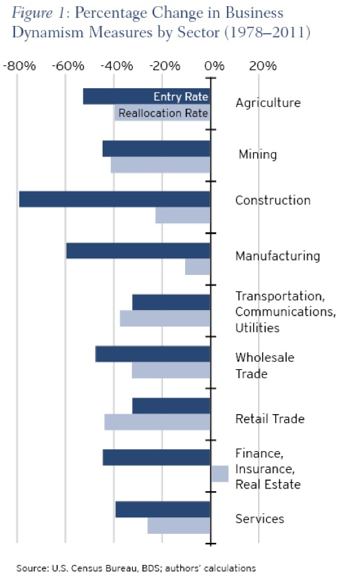

# Declining Business Dynamism: It’s For Real

**Ian Hathaway and Robert Litan**

Two weeks ago, we wrote a paper for Economic Studies at Brookings that
documented the decline in business dynamism in the United States during the last
few decades. We of course feel that this is an important issue, but it would be an
understatement to say that we have been surprised at the level of interest our work
has received.

While we’re happy to have invoked a spirited debate, we also don’t agree with some
of the analysis we’ve seen of the research. We’d like to use this opportunity to
respond to some of it.

## What We Found

To recap, our report showed a persistent decline in the rate of new firm formations
and in the job reallocation rate—a broad measure of labor market churn that results
from firm formations, expansions, contractions, and failures (what we and other
economists call “business dynamics”). We also showed that these declines were
nearly universal across the U.S. states and metros during the 30 year period
between 1978 and 2011, as well as across a broad range of industries and firm sizes.

In short, the decline in dynamism and entrepreneurship doesn’t appear to be
isolated to any one segment of the economy or region, but instead has been a widely
shared experience.

What we did not advance was a cause. Getting at why individuals are choosing not to
launch their own companies and instead opt for employment at incumbent firms is
an inherently tricky proposition. But we, and others, are making advances at getting
to an answer, and hope to have some new findings to report in the future. For now,
it is important to document what’s happening—the response from our report seems
to confirm that.

Unfortunately, not advancing a cause also left the door open for a lot of speculation
as to what is driving the decline in business dynamism—some entirely valid, some
without merit in our view, and some in-between. We address in the next sections
several of the more important questions or critiques.

## Retail and Services

One criticism is that the decline in dynamism has a lot to do with the combined
effects of (i) a shift of economic activity and employment into retail and services,
and (ii) the well-known consolidation of firms in those sectors. In other words: our
report simply reflected already well-known declines in firm formation and job
reallocation in the sectors of the economy that have experienced the most growth.
So why worry?
This critique oversimplifies. For one thing, it ignores the fact business dynamism
and firm entry are both down across each of the broad industry groups, as shown in
Figure A2 from our report (and reprinted here as Figure 1). Put differently, the
decline we documented is not limited to retail and services.

To amplify our point, consider some additional data from the same Census Bureau
series that we used in our initial report, which allow us to calculate firm entry and
job reallocation rates for the retail and services sectors versus the rates for the
remaining sectors as a group.

As shown below in Figure 2, the firm entry data tell two stories. First, excluding the
retail and services sectors pushes the firm entry rate lower, not higher as the
critique seemingly would imply. This is especially true when retail firm entrants are
excluded, since the entry rate in this sector is above average throughout the three-
decade period we examined. In contrast, the entry rate for services largely tracks or
slightly underperforms the overall rate until around 2001, after which it increases
as the non-Retail and non-Services sectors display linear declines (in fact, this
decline starts in the mid-1990s).

The patterns for job reallocation rates are slightly different. As shown in Figure 3
below, the drop in the job reallocation rate (partially a function of firm entry), is
significantly more pronounced for Retail relative to Services (before the late-1990s)
and relative the rest of the economy prior to the early 2000’s. From there, all trends
move down in a similar manner.

Services on the other hand, perform about the same as the job reallocation rate
overall. The pattern in this part of the economy suggests that the decline in
dynamism in Services is less driven by firm entry than is the case for other sectors.

So, we’re back largely where started and initially reported. It is true that retail and
services constitute a greater share of the economy than in the past, which means
any decline in dynamism in these sectors would drive down the overall rates of
dynamism and firm entry disproportionately. But the evidence is more complicated.
Both Retail and Services pushed up the firm entry rate, while for job reallocation,
Retail pushed it down significantly while Services was about average.

In a University of Maryland [working paper](http://econweb.umd.edu/~haltiwan/DHJM_JEP_5_17_2013.pdf), economists there and from the Census
Bureau took a closer look at the decline across sectors. While they make stronger
comments about the decline in Retail and Services than we do, even they conclude:

> “But we note that even in those sectors, we cannot account for most of
> the decline by taking into account simultaneously the interaction of firm
> age, firm size, detailed industry, geographic location and indicators of
> the firm operating in multiple locations. Ultimately, most of the decline
> in these sectors is in the “unexplained” within component.”

In other words, declining dynamism is real and the causes may be difficult to detect,
but the spread of large retail chains like Walmart, Starbucks, Costco, and Walgreens
does not contradict our basic finding.

## High-Growth Firms

A second criticism has been that by focusing on entrepreneurship in all sectors, we
aren’t separating the one’s that “matter” from those that “don’t.” In other words, by
including the mom-and-pop shops (predominantly in retail and services, but also in
areas like professional services and construction) along with high-growth potential
firms, we are masking the true amount of entrepreneur-driven innovation occurring
in the economy—the type of entrepreneurship that will lead to income growth and
job creation.

While we disagree with normative judgments about which types of entrepreneurs
matter and which ones don’t, there is evidence about the importance of high-growth
firms. In fact, a very small percentage of firms account for the substantial majority of
new jobs created in a given year.

The problem is that it is very difficult, if not impossible, to know at the time of
founding whether or not firms are likely to survive and/or grow. This is true even
with venture-capital backed firms, which are presumably the ones some of our
critics believe that matter, but which in fact are a tiny fraction of all firms launched
in any year. Conversely, research conducted at the Kauffman Foundation (where one
of us used to work) has shown that the large majority of firms that do grow rapidly –
making it to the Inc 500 list of fast-growing firms in any given year – never received
VC money.

The key point about the entrepreneurship rate is that it represents the commercial
equivalent of hockey’s “shots on goal.” The more firms started, the more rapidly
growing firms are likely to emerge. For that matter, and to use another sports
analogy, the more at bats we get the more doubles and triples will be produced –not
just the home runs. That is a major reason why the secular decline in the new firm
rate is so worrisome.

## Policy and Politics

We also want to caution against those who might use or have used our findings to
advance a particular partisan political agenda.

First, we have seen a number of comments in the conventional media and social
media that somehow the fact that firm exits now exceed firm births, or that the
decline in firm entry generally, is President Obama’s fault. We understand in this
highly partisan environment, the temptation to advance such claims, but we do not
believe they have merit. For one thing, it is doubtful that Presidents have much to do
with the rate of firm entry. But even if they did, our data span a period of 30 years,
and include periods when Presidents from both political parties have governed. And
yet dynamism has continued to decline over the entire period.

Second, it is difficult to pin the blame for the secular decline in dynamism on high
personal income tax rates (which matter for many startups, which increasingly are
pass-through entities), either at the federal or state level. At the federal level, the top
marginal tax rate has fallen since the Reagan tax cut of 1981 (the beginning year of
our three decade span), and yet business dynamics have declined. Meanwhile, at the
state and local levels, it is difficult to detect from the data we looked at that
differences in state and local taxes have accounted for declining dynamism, since the
decline has occurred in every state and virtually every metro area.

Third, we have speculated in comments since our report that mounting regulation –
from all levels of government – could be one factor frustrating job reallocation while
tilting against entrepreneurship. [Younger, smaller firms do not have the resources](http://static.mgnetwork.com/rtd/pdfs/20110325_SBAregulation.pdf)
that larger, more established firms do to hire full-time attorneys or compliance
officers, which should put them at a progressively larger competitive disadvantage
as regulations continue to grow in number and complexity. In other words, we think
a more relevant conversation isn’t a generic one about regulation per se, but one
that considers if our regulations systematically disadvantage entrepreneurs vis-à-
vis incumbents and larger firms. We want to stress that this “cause” for declining
dynamism is only a hypothesis at this stage, and awaits confirmation by future
researchers, but it seems to be a plausible contributing factor.

Fourth, notwithstanding the possibility that mounting regulation in general may be
one factor driving the decline in dynamism, it is also possible that the much-
criticized Affordable Care Act could eventually help to begin reversing the secular
decline in firm formation. This is because “guaranteed issue” of health insurance
without discrimination on the basis of preexisting conditions, in principle, could
loosen “[job lock](http://www.nber.org/papers/w19220)” that can inhibit employees with ideas for new businesses from
leaving more established firms to take the entrepreneurial plunge. It will take
several years, however, to see whether the data confirm or refute this plausible
hypothesis. In addition, any benefits the ACA may entail in this regard say nothing
about other critiques of the Act and proposals for how it may be improved.

Finally, as we noted in our initial report, the lowest hanging “fruit” for reversing the
decline in startups is to increase the numbers of permanent work visas for
immigrants coming here to earn advanced degrees in STEM fields and to establish
businesses in the United States. Such measures would build on the well-established
fact that immigrants generally are more likely to establish businesses than native-
born Americans. Importing more individuals with technical knowledge, in
particular, should help ensure that many of the new businesses that immigrants
launch here introduce the kinds of new scientifically advanced products, services,
and methods of production that are especially likely to enhance productivity
growth, and thus faster growth in U.S. living standards.
