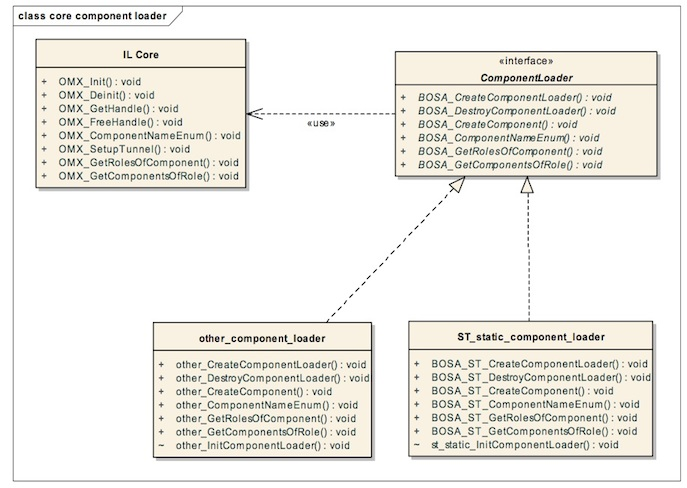
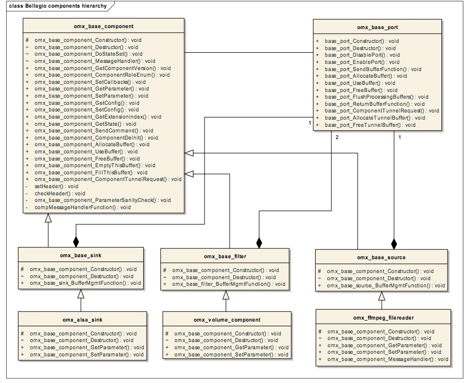

Title: Bellagio (rel. 0.3) OpenMAX Component Writer’s guide

Author: Giulio Urlini 

Date: August 21, 2007

## 1 Introduction

This guide is intended for developers that want to know more about the architecture of the OpenMAX IL components and core developed in the Bellagio Framework.

The OpenMAX APIs are standardized by Khronos, and Bellagio represents an implementation of these APIs.

This guide presents:

* A description of the Bellagio architecture and implementation
* How to implement and add a new component to the current framework
* How to implement and add a new component loader, and how to add a new set of components related to the component loader

## 2 IL core functionality and component loader mechanism

### Figure 1: IL Core hierarchy – component loader interface

The standard core functionalities are implemented in Bellagio using an interface, called component loader, which allows a particular set of components to be handled with specific functions. A new component loader can be added without changing the core functionalities except one entry point, which is a static init function for each component loader. This function will initialize the specific component loader structure and assigns the proper function pointers.

This approach allows also the porting of the Bellagio framework on a different operating system, without changing the core functions but only adding a component loader that uses the specific OS APIs.

The Figure 1 describes how the IL core uses a standard interface, the `ComponentLoader`, to access a set of implementation/OS specific functions. In the current Bellagio implementation only a static loader mechanism for Linux is available, the `ST_static` in the Figure 1, but it is possible that multiple component loader mechanism live in the same core, as show by a generic “other” loader.

### 2.1 Component Loader functions

The component loader interface is composed by a set of functions, that provides the constructor and the destructor of the loader itself, the constructor of a component, and all the functions that are used to retrieve information about available components and related roles.

One static function for each component loader is also provided, in order to fill the structure of the function pointers. This workaround is needed before starting to call the functions of the given component loader. In the case of ST static loader this function is `st_static_InitComponentLoader`.

The functions are:

* `BOSA_CreateComponentLoader`: this function is responsible to build the specific component loader, and store it, as a generic pointer, in the field `componentLoaderHandler` of the generic component loader structure. This function is executed by the IL core inside the `OMX_Init` standard function.
* `BOSA_DestroyComponentLoader`: This function is responsible to de- allocate and dispose each component loader contained. This function is called recursively for each loaded component loader in the `OMX_Deinit` function.
* `BOSA_CreateComponent`: This function is responsible for the allocation of the requested component and its resources, and it returns the standard OpenMAX component handle. This function is executed inside the standard `GetHandle` function.
* `BOSA_ComponentNameEnum`: this function enumerates all the components handled by the given component loader. It is called for each component loader inside the standard function `ComponentNameEnum`.
* `BOSA_GetRolesOfComponent`: This function returns a list of roles for the given component. This function returns NULL if the component is not handled by this component loader.
* `BOSA_GetComponentsOfRole`: this function returns all the components handled by the given component loader that provided the specified role. This function is called for all the existing component loader in order to obtain the full list of components for the given role.

### 2.2 How to build a component loader

The main actions for the implementation of a new component loader are:

1. Create a static function that assigns to a static component loader structure all the functions of the component loader interface.
2. Implement in a separate file the function described in the first section of this chapter
3. Add the static initialization function to `omxcore.c`, as described in the following paragraph.

#### 2.2.1 Addition to omxcore.c

The initialization of the function pointer is usually contained in a static function. The default component loader performs it in the `st_static_InitComponentLoader`. This function fills a static structure named `st_static_loader`. A new component loader must provide a similar function and a similar static structure.

## 2.3 More on ST static component loader

The default component loader used in Bellagio for load the given component libraries is the static loader.

The constructor of this loader reads a registry file that contains the list of all the components and the filenames of the libraries to be loaded. This registry file is usually in the `$HOME` directory, and it is named `.omxregistry`.

For each library an entry point should be provided. The function `omx_component_library_Setup` must be implemented.

This function will fill an array of structures of type `stLoaderComponentType`, one element for each component contained in the library. This structure contains the constructor function pointer for each component, and the component names, as far the roles names, if any.

A separate executable is also provided, named omxregister. This program scans in a given or default directory (`/usr/local/lib/omxcomponents`) for OpenMAX components that are compatible with the ST static component loader, or in other words, libraries that contain the function `omx_component_library_Setup`.

## 3 OpenMAX hierarchy

The Bellagio OpenMAX component hierarchy can be described as in the following class diagram:

### Figure 2: Bellagio OpenMAX component hierarchy

The base class of the Bellagio hierarchy is the `omx_base_component` class. It contains the implementation of the basic OpenMAX standard functions: buffer creation and handling functions, retrieving and setting information, sending commands. The internal functions, not defined by OpenMAX are a constructor and a destructor, a message handler for the asynchronous commands received. All the functions related to buffers, allocation and dynamic send and retrieve data, are implemented in the `omx_base_port` class, and only the entry points are stored in the base component. Depending on the number of ports for a given component is composed the second layer of the Bellagio hierarchy. The class `omx_base_filter` is a generic component with an input and an output port. It contains the instance of two ports, which can be based or derived, it extends the base constructor with a derived constructor and it implements a new function, the `bufferMgmtFunction`. This function realized a generic data transfer from input to output, which can be enough in many cases. It comprehends also the possibility to flush ports, and every check needed by the OpenMAX spec. If the developer needs a particular mechanism not covered by it, this function should be overridden. The only point that remains unimplemented at this level is the central processing function, named `BufferMgmtCallback`, implemented by the final component. In the following paragraphs all the details of this architecture are described.

### 3.1 OpenMAX Bellagio data structures

Any class in Bellagio hierarchy is described by a structure that contains variables and function pointers. The `omx_base_component` class is realized by a structure of type ` omx_base_component_PrivateType`. The `omx_base_filter` class is described by the structure of type `omx_base_filter_PrivateType`, which contains also the base structure fields. The base fields in the derived structure are at the beginning of the structure, so that a cast to the base type can isolate the base data. In the same way the source components are described by the structure `omx_base_source_PrivateType`, and the sink components with the structure `omx_base_sink_PrivateType`.

Any final component derived from a base filter, sink or source should build a new structure that contains at the beginning the filter, sink or source structure. Each component is characterized but a fixed number of ports, that can not be changed during execution. This is an OpenMAX requirement. These ports are considered in the Bellagio architecture as classes, described by base structure of type `omx_base_PortType`, or special derived structures if needed by some types of components. The port structures are derived in the same way described for component structures.

### 3.2 OpenMAX base component

The base component implements four sets of functionalities:

* The constructor function that assigns all the default function pointers to the base private type structure. All this assignment can be changed by a derived constructor function. The constructor function of the final component, derived from this base constructor, is assigned to the core. It is executed by the core when a new `getHandle` is executed.
* The OpenMAX standard calls. All these calls are assigned to the base structure, but not all the functions are fully implemented. In many cases the derived classes will override this default functions.
* A set of internal functions. They are a destructor, the handler of asynchronous messages, which is contained in a separate thread, and the function that changes the OpenMAX state due to an IL client request.
* Some utility functions that can be used also by the final components.

All the functions implemented by the base component class are described in the following paragraphs.

#### 3.2.1 Base constructor

`base_component_Constructor`: the constructor fills the omx_base_component_PrivateType structure with default values. It does not fill any field that belongs to derived classes.

This function is called by the final component constructor that is called by the ST static component loader when the `getHandle` function is called. This function is implemented also by the derived classes. It should be called first in the derived functions, and after this base constructor the specific fields of the derived structures can be filled. This allows the replacement of any base field, if needed.

#### 3.2.2 OpenMAX standard calls

The OpenMAX standard functions implemented in the base components are the following. The full description of these functions is out of the scope of this document. It is only documented when these functions are used as they are, and when they need an override by the derived components.

Some of these functions are only wrappers for functions implemented by port class.

* `base_component_ComponentDeInit`: no override needed.
* `base_component_GetComponentVersion`: no override needed.
* `omx_base_component_ComponentRoleEnum`: This function is intended to be used only by an IL core. The ST static core in any case does not use this function, because it can not be used before the creation of the component. The ST core uses a static list instead. It is implemented only for API completion, and it will be not overridden by a derived component
* `base_component_SetCallbacks`: no override needed.
* `base_component_GetParameter`: this function is overridden by the final component for each parameter specific to the component. For the basic parameters this function is called.
* `base_component_SetParameter`: this function is overridden by the final component for each parameter specific to the component. For the basic parameters this function is called.
* `base_component_GetConfig`: this function is overridden by the final component for each configure value specific to the component. For the basic configure values this function is called.
* `base_component_SetConfig`: this function is overridden by the final component for each configure value specific to the component. For the basic configure values this function is called.
* `base_component_GetExtensionIndex`: no override needed.
* `base_component_GetState`: no override needed.
* `base_component_SendCommand`: no override needed.
* `base_component_AllocateBuffer`: this function is a wrapper of the function `Port_AllocateBuffer` that is a pointer to a base or derived function of the port class. The port that implements this function is the port on which the buffer must be allocated. In any case this wrapper does not need any override. Any needed change must be applied to the port function instead.
* `base_component_UseBuffer`: this function is a wrapper of the function `Port_UseBuffer` that is a pointer to a base or derived function of the port class. The port that implements this function is the port on which the buffer must be assigned. In any case this wrapper does not need any override. Any needed change must be applied to the port function instead.
* `base_component_FreeBuffer`: this function is a wrapper of the function `Port_FreeBuffer` that is a pointer to a base or derived function of the port class. The port that implements this function is the port on which the buffer must be freed. In any case this wrapper does not need any override. Any needed change must be applied to the port function instead.
* `base_component_EmptyThisBuffer`: this function is a wrapper of the function `Port_SendBufferFunction` that is a pointer to a base or derived function of the port class. In any case this wrapper does not need any override. Any needed change must be applied to the port function instead.
* `base_component_FillThisBuffer`: this function is a wrapper of the function `Port_SendBufferFunction` that is a pointer to a base or derived function of the port class. In any case this wrapper does not need any override. Any needed change must be applied to the port function instead.
* `base_component_ComponentTunnelRequest`: this function is a wrapper of the function `ComponentTunnelRequest` that is a pointer to a base or derived function of the port class. In any case this wrapper does not need any override. Any needed change must be applied to the port function instead.

#### 3.2.3 Internal functions

* `omx_base_component_Destructor`: This function is called in the implementation of the standard `DeInit` function. The `DeInit` function does not need any override. Anything specific can be implemented in a derived version of this destructor.
* `omx_base_component_DoStateSet`: this function changes the state of the component due to a request, checking the state change consistency and modifying the internal variables if needed. It needs an override only if some special action must be inserted during a state change.
* `compMessageHandlerFunction`: This function, executed in a separate thread, stores the requests from the IL client done with the SendCommand, put them in a queue and dispatch them to the component. This function is created basically because the requests are asynchronous and can be received from different threads.
* `omx_base_component_MessageHandler`: this function is the message handler for each component. It reads any request from the user through a message queue, filled in the `compMessageHandlerFunction`. It is also responsible for dispatching messages to the IL client in case of error, or warning. This function does not need any override, basically, but if some special message handling is needed, the developer can implement a derived message handler function, and call this base function after its special handling. In the components included in the Bellagio distribution, no special message handling is implemented.

#### 3.2.4 Utility functions

* `checkHeader`: This function checks that a given OpenMAX structure is correct. It checks the first two fields, which specify the version and the size of the structure.
* `setHeader`: This function adds to a generic OpenMAX structure the correct version, in the standard way specified by OpenMAX spec.
* `omx_base_component_ParameterSanityCheck`: This function checks the correctness of the state of the component and the port when a `SetParameter` for that component and that port is executed.

### 3.3 Base Port

All the functionalities related to ports and buffers are implemented by a separate class, the base port. The base port implements some OpenMAX standard functions that are called inside the base components but are implemented here. These functions are:

* `base_port_AllocateBuffer`: this function allocates a buffer of the requested size, allocates the OpenMAX buffer header and assigns the buffer to the port.
* `base_port_UseBuffer`: This function allocates the OpenMAX buffer header and assigns the given buffer to it and to the port.
* `base_port_FreeBuffer`: This function deallocates the given buffer and buffer header.
* `base_port_SendBufferFunction`: This function corresponds to an `EmptyThisBuffer` or a `FillThisBuffer`, if the port is an input or an output port.
* `base_port_ComponentTunnelRequest`: this function checks if the port can be connected to a given port with a tunnel. If the ports are compatible all the parameters related to the connection are established, and if needed the tunnel buffers are implemented.

The port class implements also the constructor and destructor, and several function to support the OpenMAX specification, regarding the allocation of buffers in case of tunneling, the flushing of the buffer when requested, and the disable enable setting of the port. These functions are sued in the base component classes, and in general the final component does not need to access directly these functions. For special needs in any case it is possible to execute directly these functions, or override them. These functions briefly are:

* `base_port_FlushProcessingBuffers`: this function is used to flush the buffers under processing, or in the process queue, if the flush is requested, or the port has been disabled.
* `base_port_DisablePort`: This function disables the port
* `base_port_EnablePort`: This function enables the port
* `base_port_AllocateTunnelBuffer`: This function allocates the buffers in case of tunneling if the port is the supplier and the allocator of the buffers.
* `base_port_FreeTunnelBuffer`: This function is used to free the buffers used for tunnel, if any.

Finally the port class implements a common function used to executed the IL
client callbacks. This function is `base_port_ReturnBufferFunction`.

### 3.4 The derived classes

There are three first level derived classes: the filter component, the sink component and the source component. In the future the mixer and splitter components will be added.

### 3.5 Filter component

Common overrides:

 • `base_filter_component_Constructor`: the base constructor is overridden, in order to fill all the port parameters, specific for a generic filter component, characterized by an input and an output port. This constructor also adds the function pointer for the central buffer handling functionality (`BufferMgmtFunction`).

The new functionality is:

 • `base_filter_component_BufferMgmtFunction`: this function is executed in a separate thread, and is responsible for receiving the buffers from a queue, filled by the `EmptyThisBuffer` function, and put the filtered data in the output buffers that are in another queue filled by the `FillThisBuffer` function. The main filter functionality is executed by the `BufferMgmtCallback` that is implemented in the final filter class.

### 3.6 Source and sink components

The same functions presented for the filter are implemented in the sink and source base components. The only difference is related to the number of ports. For instance the `BufferMgmtCallback` prototype in case of sink component has only an input buffer parameter, and the source component function has only the output buffer parameter.

### 3.7 Final complete OpenMAX component

Any final component in the Bellagio architecture should be derived from a filter, a sink, a source base component.

If the component handles the buffers during processing with the `omx_base_filter_BufferMgmtFunction`, it must implement the function `BufferMgmtCallback`. The use of this handler is not mandatory, but it solves several issues, related to buffer flushing and buffer processing, and finally it calls the user callback to signal the data transfer status. These functions and the methodology in general can be overridden if needed.

The `BufferMgmtCallback` function is the central filtering functionality. It receives a buffer in input and produced a buffer in output. It implements a specific filtering mechanism, a decoder, encoder, effect, of any transfer function. The final component must also override the following functions:

* `omx_final_component_Constructor`: in this function are initialized and assigned all the fields related to the specific codec or device abstracted by this component. The constructor of the base class should be called first.
* `omx_final_component_Destructor`: This function disposes all the ports, and removes any specific memory allocated by the final component. At the end of this function the base filter destructor should be called.
* `omx_final_component_GetParameter`: this function returns any specific parameter of the final class. For any other parameter the base function should be called at the end.
* `omx_final_component_SetParameter`: this function sets any specific parameter of the final class. For any other parameter the base function should be called at the end.
* `omx_final_component_GetConfig`: this function returns any specific configuration value of the final class. For any other configuration value the base function should be called at the end.
* `omx_final_component_SetConfig`: this function sets any specific configuration value of the final class. For any other configuration value the base function should be called at the end.

In some cases other functions can be overridden. The following example can be found in the mad decoder component, in the Bellagio distribution.

`omx_mad_decoder_MessageHandler`: the mad decoder needs a specific initialization during the state transition from loaded to idle. In the same way it requires activation during the transition from idle state to executing.

The override of the message handler function allows the addition to a state transition request the initialization, and after that the usual base handling can be performed.

The final component must implement the buffer management central function, which contains the core of its processing. The implementation of this function is required only if the default buffer management handling provided by the framework has been chosen. If the developer needs to implement a different mechanism, the base function of buffer handling and any derived function should be overridden.

The function to override in any case is the function `omx_final_component_BufferMgmtCallback`. This function is the central filtering functionality. It receives a buffer in input and produced a buffer in output in the case of a filter component.
