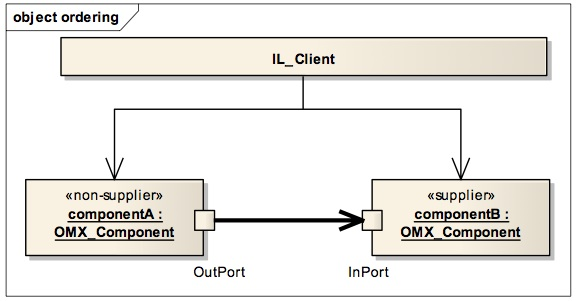
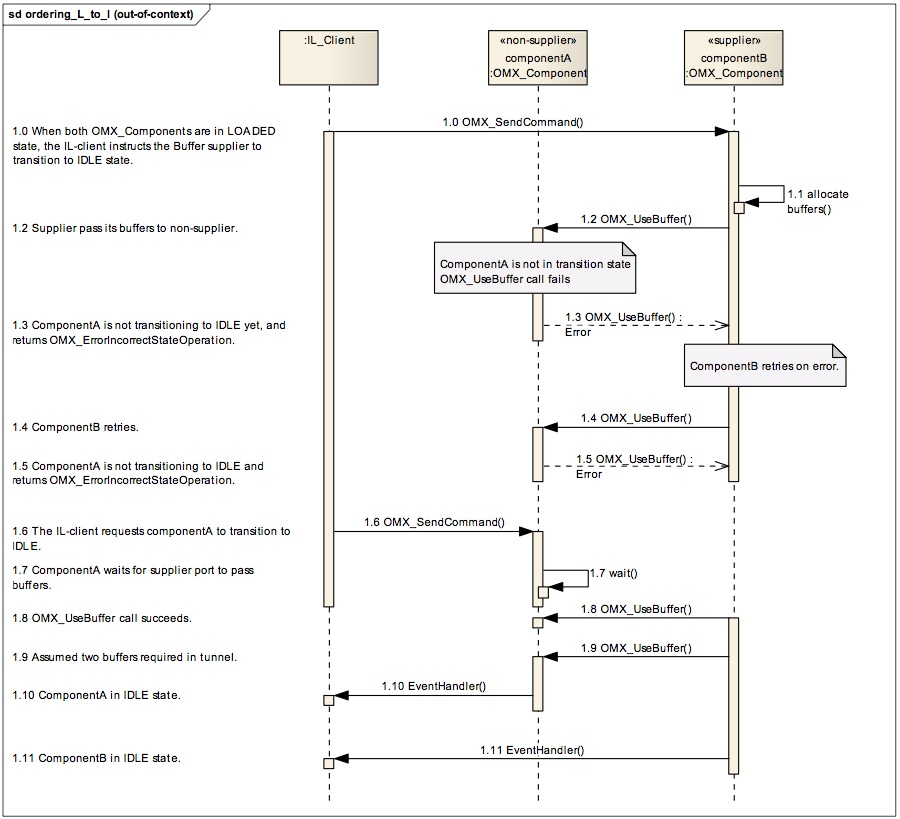
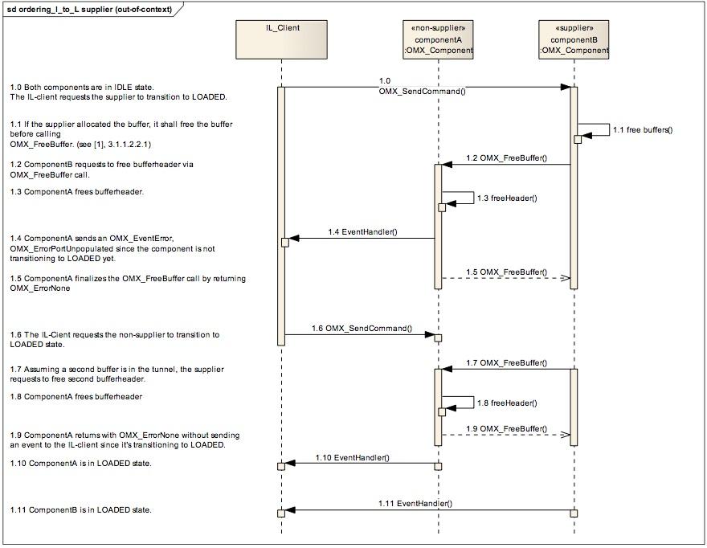
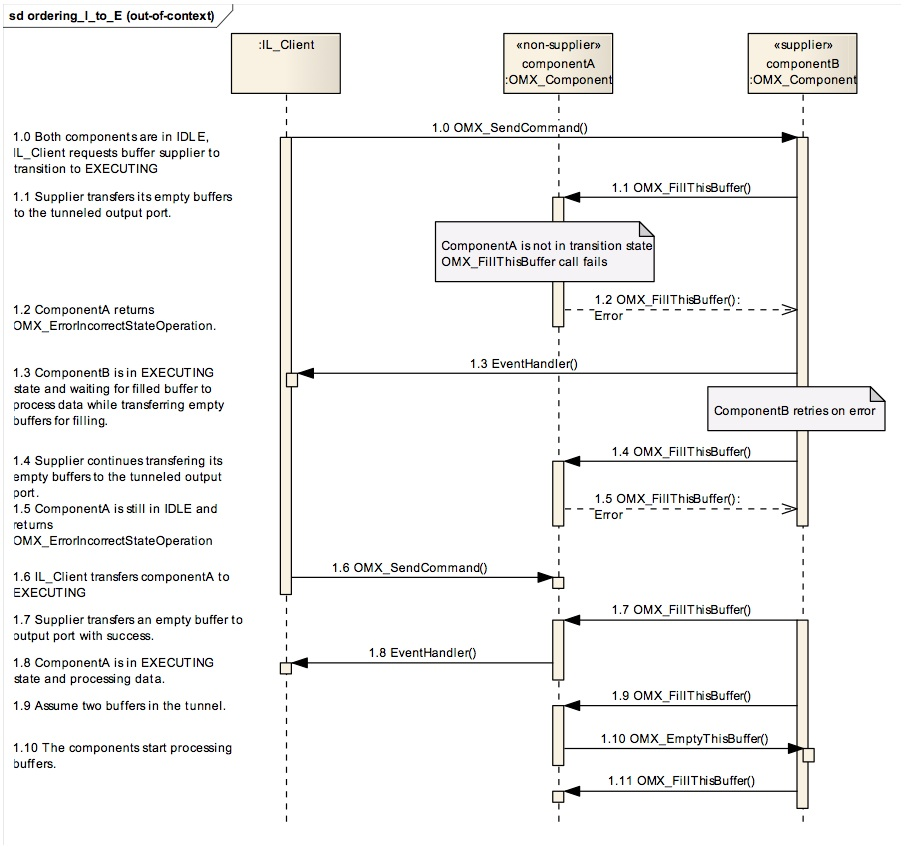
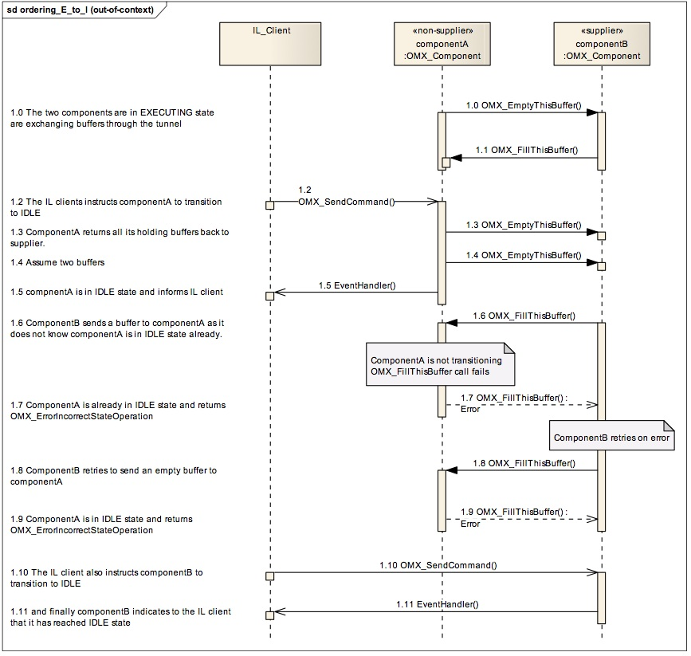
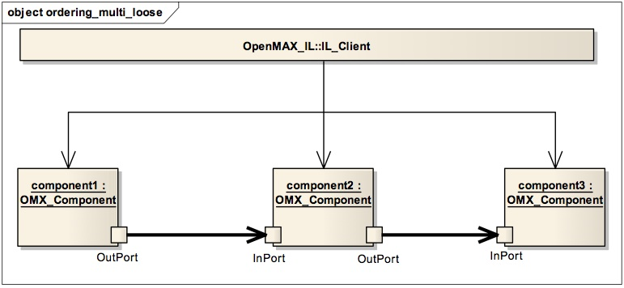
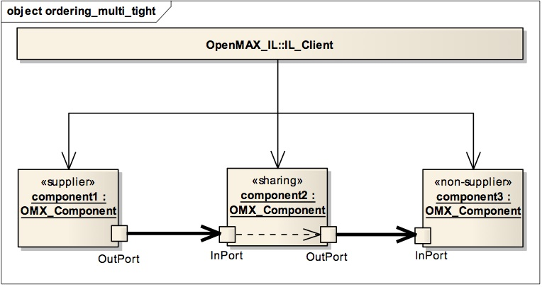
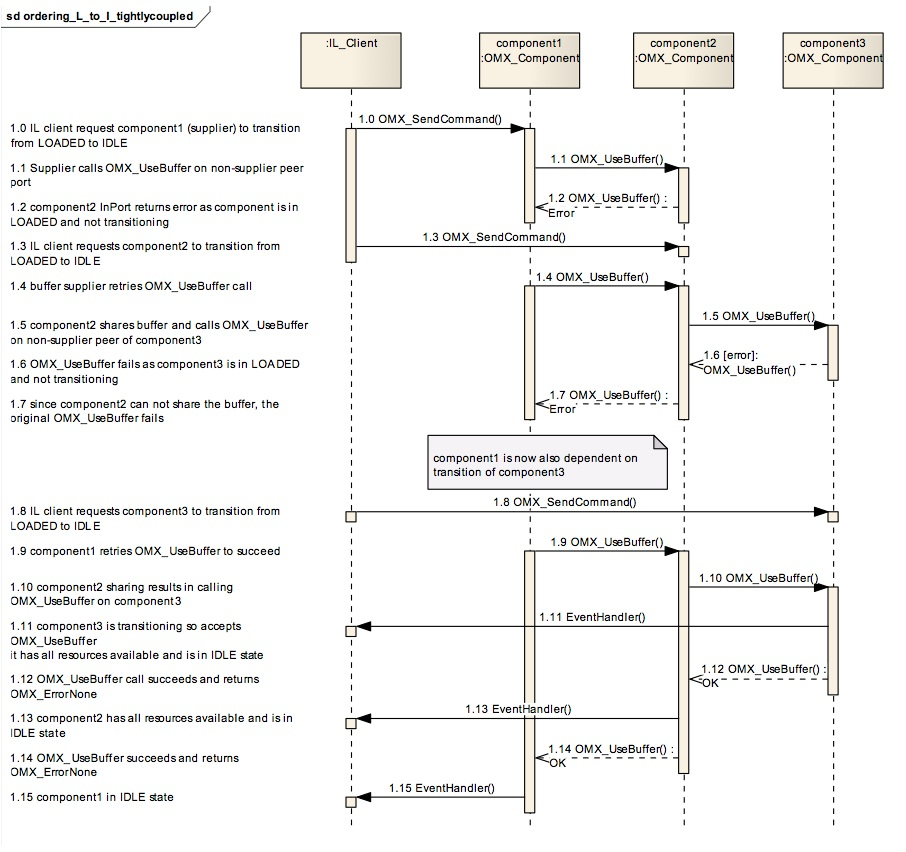

# OpenMAX™ Integration Layer Application Note Version 1.1.2

## 1. Outline

### 1.1. Scope

This document outlines implementation guidelines for OpenMAX-IL component and
client developers. These guidelines avoid unexpected and unwilling behavior (also
known as race-conditions) during component interactions in transitional states.

This application note should be read together with the OpenMAX-IL version 1
specification (see [\[1\]](https://www.khronos.org/registry/omxil/specs/OpenMAX_IL_1_1_2_Specification.pdf) ), and clarifies some parts in the specification that could be
misunderstood.

This document is restricted to OpenMAX-IL version 1.0 and 1.1, interop profile (see [\[1\]](https://www.khronos.org/registry/omxil/specs/OpenMAX_IL_1_1_2_Specification.pdf),
paragraph **2.1.3.1**) and for an execution model where the data processor, including
callbacks, is handled in a thread(s) different than IL-Client’s thread (see [\[1\]](https://www.khronos.org/registry/omxil/specs/OpenMAX_IL_1_1_2_Specification.pdf), **Figure2-5**).

### 1.2. Introduction

The OpenMAX-IL 1.1.x specification defines a clear state-model (see [\[1\]](https://www.khronos.org/registry/omxil/specs/OpenMAX_IL_1_1_2_Specification.pdf), **Figure2-3**), the
valid component calls within a state (see [\[1\]](https://www.khronos.org/registry/omxil/specs/OpenMAX_IL_1_1_2_Specification.pdf), **Table3-10**), and the component state
transitions (see [\[1\]](https://www.khronos.org/registry/omxil/specs/OpenMAX_IL_1_1_2_Specification.pdf), **Figure3-1**).

In interop profile, the OpenMAX-IL client is building an OpenMAX-IL network that
consists of two (or more) ‘peer’ components, as shown in [Figure 1-1](#fg1-1) below. Furthermore
the OpenMAX-IL client instructs the OpenMAX-IL components belonging to the
network to transition to a next state. These instructions are on a per component basis and
handled asynchronously by the OpenMAX-IL components.

**Figure 1-1: Object Ordering**

The OpenMAX-IL interop components are in transitional states (neither visible to
OpenMAX-IL client, nor to OpenMAX-IL peer component) when the OpenMAX-IL
client has submitted the request, but the OpenMAX-IL component has not reached the
new state yet.

To reach the new state, sometimes the OpenMAX-IL component is relying on the
behaviour of the peer component. This behaviour is dependent on Buffer supplier
negotiation results after OMX_SetupTunnel and (transitional) state of the peer
component, hence it’s important to clearly define the expected behaviour to endorse
interoperability in the **interactions between multiple OpenMAX-IL interop
components in transitional states**.

The execution time to bring peer IL_Components into the new state is dependent on:

+ `Tclient` is the time between issuing both OMX_SendCommand operations
    (client dependent)
+ `Tcomp` is the time to execute the actual command (platform dependent).

Both execution times are not specified. This execution time, and also the order of calls,
could result in certain conditions that are not specified or even do not fully comply to the
OpenMAX-IL specification.

The OpenMAX-IL specification shows a set of calling sequences (see [\[1\]](https://www.khronos.org/registry/omxil/specs/OpenMAX_IL_1_1_2_Specification.pdf), paragraph **3.4**).
These sequence diagrams assume a fast reactive system. Furthermore the sequence
diagrams show transitioning a component first, while sometimes transitioning the ‘other’
component first could be of at least equal interest.
This application note describes a set of implementation guidelines such that the
conditions are set to be interoperable and complements the sequence diagrams in the
OpenMAX-IL specification (see [\[1\]](https://www.khronos.org/registry/omxil/specs/OpenMAX_IL_1_1_2_Specification.pdf), paragraph 3.4).

These guidelines are considered as “Should”, according the definition in OpenMAX-IL
specification (see [\[1\]](https://www.khronos.org/registry/omxil/specs/OpenMAX_IL_1_1_2_Specification.pdf) **Table1-1**). The OpenMAX-IL workgroup recommends the
implementation of the proposed guidelines for both OpenMAX-IL client developers as
well as OpenMAX-IL component developers.

The following topics are described:

* Allocate/Destroy buffers in transitional states
       + Loaded to Idle
       + Idle to Loaded
* Communicating buffers in transitional states
       + Idle to Executing
       + Executing to Idle
* Port Enable/Disable
* Complex graphs

The application note finishes with the guidelines:

* Recommendations for implementers

### 1.3. References

\[1\] [OpenMAX-IL 1.1.2 specification](https://www.khronos.org/registry/omxil/specs/OpenMAX_IL_1_1_2_Specification.pdf), see <https://www.khronos.org/openmax>

## 2. Allocate/Destroy buffers in transitional states

This chapter describes the expected behaviour while transitioning between
OMX_StateLoaded and OMX_StateIdle in both directions.

#### 2.1.1. Loaded to Idle

The OpenMAX-IL specification describes that the `OMX_UseBuffer` macro shall be
executed when the called component is in `OMX_StateLoaded` state and has already
received a request for the state transition to `OMX_StateIdle` (see [\[1\]](https://www.khronos.org/registry/omxil/specs/OpenMAX_IL_1_1_2_Specification.pdf), Section **3.2.14**).

The OMX_component that acts as buffer supplier calls `OMX_UseBuffer` on the tunnelled
`OMX_component` to create the bufferheader. Both `OMX_component`s are requested to
transition from `OMX_StateLoaded` to `OMX_StateIdle` by the IL-client via two
asynchronous calls.

As shown in the OpenMAX-IL specification (see [\[1\]](https://www.khronos.org/registry/omxil/specs/OpenMAX_IL_1_1_2_Specification.pdf), Figure **3-10**), when the non-
Supplier port is transitioned first, it waits for the Supplier port to call the non-supplier’s
`OMX_UseBuffer` method. So irrespectively of the component scheduling, the system
behaves as expected.

However an erroneous condition can occur when the Supplier port is transitioned first.
The supplier will issue an `OMX_UseBuffer` call while the non-Supplier has not received
its request to transition to OMX_StateIdle yet:

+ Non-supplier (in **LOADED** state, not transitioning) receives an `OMX_UseBuffer`
   call

[Figure 2-1](#fg2-1) illustrates the expected behaviour of each tunnelled component during the
state transition when the Supplier port is transitioning first.

**Figure 2-1: Transition to Idle while Supplier first**

On reception by `componentB` of the command to transition to `OMX_StateIdle`, the
supplier port shall pass its buffers to its peer non-supplier port via `OMX_UseBuffer`.
Since `componentA` has not received the request to transition to `OMX_StateIdle`, the non-
supplier port should reject the Buffer via returning `OMX_ErrorInvalidStateOperation`.
Now the supplier port should retry (typically after a small delay) to pass its buffer again
to its peer non-supplier port via `OMX_UseBuffer` and should keep trying until success
(return `OMX_ErrorNone`). On success, the supplier shall further transfer all its buffers to
the non-supplier via `OMX_UseBuffer`. Now both OMX-Components are transitioned to
`OMX_StateIdle`.

It is assumed that the non-supplier port is transitioned to `OMX_StateIdle` during the
period of retries. An IL-client may use a timer to guard the transition to happen within an
expected time.

#### 2.1.2. Idle to Loaded

The `OMX_component` that acts as buffer supplier holds all the buffers in `OMX_StateIdle`.
During transitioning to `OMX_StateLoaded`, the buffer suppliers shall free their buffers
and call `OMX_FreeBuffer` to tunnelled component (non-supplier) to free the bufferheader.
Note that `OMX_FreeBuffer` is allowed in any state (see [\[1\]](https://www.khronos.org/registry/omxil/specs/OpenMAX_IL_1_1_2_Specification.pdf), Table **3-10**).

When transitioning `componentA` (non-supplier port) first, it waits for the supplier port to
send `OMX_FreeBuffer`. So irrespectively of the component scheduling, the system
behaves as expected.

As shown in the OpenMAX-IL specification (see [\[1\]](https://www.khronos.org/registry/omxil/specs/OpenMAX_IL_1_1_2_Specification.pdf), Figure **3-15**), if the component that
holds the supplier port is transitioned first and the component holding the non-supplier
port is already transitioning to `OMX_StateLoaded`, the system behaves as expected.

[Figure 2-2](#fg2-2) illustrates, if `componentB` (supplier port) is transitioned first while
`componentA` (non-supplier port) is not transitioning yet.

**Figure 2-2: Transition to Loaded while Supplier first**

As described (see [\[1\]](https://www.khronos.org/registry/omxil/specs/OpenMAX_IL_1_1_2_Specification.pdf), paragraph **3.2.2.16**), the `OMX_FreeBuffer` call can be made any
time, and may result in a port sending `OMX_ErrorPortUnpopulated` error event to the IL-
client. This event error should be interpreted as a warning to the IL-client and can be
ignored if the client is transitioning the OpenMAX-IL network to `OMX_StateLoaded`.

### 2.2. Communicating buffers in transitional states

This chapter describes the expected behaviour while transitioning between
`OMX_StateIdle` and `OMX_StateExecuting` in both directions.

#### 2.2.1. Idle to Executing

The OpenMAX-IL specification describes that buffers are transferred using
`OMX_EmptyThisBuffer`/`OMX_FillThisBuffer` call sequences on connected OpenMAX-
IL ports (see [\[1\]](https://www.khronos.org/registry/omxil/specs/OpenMAX_IL_1_1_2_Specification.pdf), Table **3-10**). A component in `OMX_StateIdle` state has all resources and
has not transferred any buffers or has not processed any data. The location of buffers is at
Supplier only (see [\[1\]](https://www.khronos.org/registry/omxil/specs/OpenMAX_IL_1_1_2_Specification.pdf), Table **3-3**). A component is transferring buffers and is processing
data (if data is available) in `OMX_StateExecuting` state. The location of buffers is at
Supplier or Non-Supplier (see [\[1\]](https://www.khronos.org/registry/omxil/specs/OpenMAX_IL_1_1_2_Specification.pdf), Table **3-3**).

The OpenMAX-IL specification also defines that during transitional states from
`OMX_StateIdle` to `OMX_StateExecuting`, the component shall begin transferring and
processing data. Among tunnelling ports, any input port that is also a supplier shall
transfer its empty buffers to the tunnelled output port via `OMX_FillThisBuffer` (see [\[1\]](https://www.khronos.org/registry/omxil/specs/OpenMAX_IL_1_1_2_Specification.pdf),
paragraph **3.1.1.2.2.2**).

When the non-Supplier port is transitioned first, it waits for the Supplier port to send
buffers for processing (`OMX_FillThisBuffer` if input port is supplier). So irrespectively
of the component scheduling, the system behaves as expected.

However an erroneous condition can occur when the Supplier port is transitioned first.
The supplier will issue an `OMX_EmptyThisBuffer`/`OMX_FillThisBuffer` call while the
non-Supplier has not received its request to transition to `OMX_StateExecuting` yet:

+ Non-supplier (in **IDLE** state, not transitioning) receives an
    `OMX_EmptyThisBuffer`/`OMX_FillThisBuffer` call

[Figure 2-3](#fg2-3) illustrates the expected behaviour of each tunnelled component during the
state transition when the Supplier port is transitioning first.

**Figure 2-3: Transition to Executing while Supplier first**

On reception by `componentB` of the command to transition to `OMX_StateExecuting`, the
supplier port shall pass its buffers to its peer non-supplier port via `OMX_FillThisBuffer`.
Since `componentA` has not received the request to transition to `OMX_StateExecuting`, the
non-supplier port should reject the Buffer via returning
`OMX_ErrorInvalidStateOperation`. Since `componentB` is ready for processing, it reports
to the IL-client it has reached `OMX_StateExecuting`.

Now the supplier port should retry (typically after a small delay) to pass its buffer again
to its peer non-supplier port via `OMX_FillThisBuffer` and should keep trying until
success (return `OMX_ErrorNone`). On success, the supplier shall further transfer all its
buffers to the non-supplier via `OMX_FillThisBuffer`. The non-supplier is transferred to
`OMX_StateExecuting` after reception of the `OMX_SendCommand` and further processing
can happen as shown in ([\[1\]](https://www.khronos.org/registry/omxil/specs/OpenMAX_IL_1_1_2_Specification.pdf), Figure **3-12**).

It is assumed that the non-supplier port is transitioned to `OMX_StateExecuting` during the
period of retries. An IL-client may use a timer to guard the transition to happen within an
expected time.

####   2.2.2. Executing to Idle

On transitioning from `OMX_StateExecuting` to `OMX_StateIdle`, the components shall
return all buffers to their respective suppliers and receive all buffers belonging to its
supplier ports before completing the transition (see [\[1\]](https://www.khronos.org/registry/omxil/specs/OpenMAX_IL_1_1_2_Specification.pdf), paragraph **3.1.1.2.3.1**).

When the supplier port is transitioned first, it waits for the non-supplier port to return
buffers for processing (`OMX_EmptyThisBuffer` if input port is supplier and
`OMX_FillThisBuffer` if output port is supplier). So irrespectively of the component
scheduling, the system behaves as expected (see [\[1\]](https://www.khronos.org/registry/omxil/specs/OpenMAX_IL_1_1_2_Specification.pdf), Figure **3-15**).

However an erroneous condition can occur when the non-supplier port is transitioned first.
The non-supplier will return all buffers via `OMX_EmptyThisBuffer`/
`OMX_FillThisBuffer` calls. While the supplier has not received a request to transition to
`OMX_StateIdle`, the supplier will continue to call `OMX_FillThisBuffer`/
`OMX_EmptyThisBuffer` respectively:

+ Non-supplier (in **IDLE** state already, not transitioning) receives an
   `OMX_EmptyThisBuffer`/`OMX_FillThisBuffer` call

[Figure 2-4](#fg2-4) illustrates the expected behaviour of each tunnelled component during the
state transition when the non-supplier port is transitioning first.

**Figure 2-4: Transition to Idle while non-Supplier first**

On reception by `componentA` of the command to transition to `OMX_StateIdle`, it returns
buffers to the supplier port via `OMX_EmptyThisBuffer` before finishing the transition to
`OMX_StateIdle`. `ComponentB` is not aware of its peer component state and while
remaining in `OMX_StateExecuting`, it requests `componentA` to fill a new buffer again via
`OMX_FillThisBuffer`.

Since `componentA` is already in `OMX_StateIdle`, the non-supplier port should reject the
buffer via returning `OMX_ErrorInvalidStateOperation`.
Now the supplier port should retry (typically after a small delay) to pass its buffer again
to its peer non-supplier port via `OMX_FillThisBuffer` and should keep trying until
success (return `OMX_ErrorNone`).

On reception of the `OMX_SendCommand` to transition to `OMX_StateIdle`, componentB
stops sending buffers to `componentA`. Since `componentB` has all buffers in its queue, it
can finish the transition to `OMX_StateIdle` and report this to the IL-client.

It is assumed that the supplier port is transitioned to `OMX_StateIdle` during the period of
retries. An IL-client may use a timer to guard the transition to happen within an expected
time.

## 3. Port Enable/Disable

The OpenMAX-IL specification defines an operation to enable or disable an individual
port using `OMX_CommandPortDisable` and `OMX_CommandPortEnable` (see [\[1\]](https://www.khronos.org/registry/omxil/specs/OpenMAX_IL_1_1_2_Specification.pdf),
paragraph **3.2.2.5** and **3.2.2.6**)

When an application is using port disablement and enablement in interop profile, it
executes a ‘**pair**’ of transition operations on the tunnel, one to each (non-sharing) port
(see [\[1\]](https://www.khronos.org/registry/omxil/specs/OpenMAX_IL_1_1_2_Specification.pdf), paragraph **3.4.4**).

As described in previous sections, the behaviour of the system can be dependent on the
time between subsequent transitions on ‘**peer**’ `OpenMAX_IL` components, or ports as
explained in this section.

### 3.1. Transition to Port Disabled

On transitioning the non-supplier first using `OMX_CommandPortDisable`, the non-
supplier returns all buffers to the supplier and waits for `OMX_FreeBuffer` calls to finalize
the transition. The supplier continues sending `OMX_EmptyThisBuffer`/
`OMX_FillThisBuffer` while not transitioning to port **DISABLE** yet:

+ A non-supplier port transitioning from ENABLE to **DISABLE** should return an
    error (`OMX_ErrorIncorrectStateOperation`) on reception of
    `OMX_EmptyThisBuffer`/ `OMX_FillThisBuffer`
+ An **ENABLED** port, from a component in `OMX_StateExecuting`, should continue
    retrying to send `OMX_EmptyThisBuffer`/`OMX_FillThisBuffer` on reception of
    the error.

On transitioning the supplier first using `OMX_CommandPortDisable`, the supplier frees
buffers and calls `OMX_FreeBuffer` on its peer. The non-supplier should accept the call
and free the bufferheader, and if not transitioning to port **DISABLE** yet may report an
OMX_PortUnpopulated event to the IL-client.

### 3.2. Transition to Port Enabled

On transitioning the non-supplier first using `OMX_CommandPortEnable`, it waits for
`OMX_UseBuffer` calls from the supplier. The supplier provides the buffers once it
receives the command to enable its port. So the system reacts as expected.

On transitioning the supplier first using `OMX_CommandPortEnable`, the supplier calls
`OMX_UseBuffer` on its non-supplier peer:

+ A **DISABLED** port should return an error (`OMX_IncorrectStateOperation`) on
    reception of `OMX_UseBuffer`.
+ A port transitioning from **DISABLE** to **ENABLE** should continue retrying to send
    `OMX_UseBuffer` on reception of the error.

## 4. Complex graphs

The previous sections have described a simple 2 component graph model, although a
graph can exist out of more components tunnelled together and even multiple subgraphs
‘mixed’ together. For the sake of simplicity, let’s consider a three components graph as
an example of a complex graph. The three components tunnelled together can be either
loosely coupled tunnels or tightly coupled tunnels. Loosely coupled tunnels consist of
tunnels that work ‘rather’ independent, while tightly coupled tunnels use Buffer Sharing
Relationships (see [\[1\]](https://www.khronos.org/registry/omxil/specs/OpenMAX_IL_1_1_2_Specification.pdf), **fig2-6**).

### 4.1. Loosely coupled graphs

**Figure 4-1: Loosely coupled complex graph**

When transitioning states (including **Port-Disable**/**Port-Enable**), there could be some
loose coupled dependencies between the tunnels. Following configurations are possible
in the figure above:

 | Component1 OutPort | Component2 InPort | Component2 OutPort | Component3 InPort
--------|--------------|----------|----------|----
Config1 | Non-supplier | Supplier | Supplier | Non-supplier
Config2 | Supplier | Non-supplier | Non-supplier | Supplier
Config3 | Supplier | Non-Supplier | Supplier | Non-supplier
Config4 | Non-supplier | Supplier | Non-supplier | Supplier

The behaviour as described in previous sections holds also for these loosely coupled
graphs:

+ An `OMX_UseBuffer` call can be received by a component in `OMX_StateLoaded`
     and should be rejected
+ An `OMX_EmptyThisBuffer`/`OMX_FillThisBuffer` call can be received on a
     component in `OMX_StateIdle` and should be rejected
+   Report an `OMX_ErrorPortUnpopulated` event on reception of an
    `OMX_FreeBuffer` call while not transitioning from `OMX_StateIdle` to
    `OMX_StateLoaded`

Next to this known behaviour, there is no additional unexpected behaviour in loosely
coupled graphs.

### 4.2. Tightly coupled graphs

**Figure 4-2: Tightly coupled complex graph**

When buffer sharing is used, the coupling between tunnels is tightened. As an example
[Figure 4-3](#fg4-3) below illustrates the dependency of component1 on the transition request of
component3 when State Transition from Loaded to Idle (`Config3`).

**Figure 4-3: Transition to Idle in tightly coupled complex graph**

An IL-client should instruct all components belonging to a tightened graph to transition
to the new state as a set of `OMX_SendCommand` calls closely together.

## 5. Recommendations for implementers

Guidelines for IL-Components

1. Components should handle a command as fast as possible.
2. Components (in **LOADED** state and not transitioning) or (with **DISABLED** port
   and not transitioning), should not accept `OMX_UseBuffer` and return an error
   (`OMX_ErrorIncorrectStateOperation`) to their tunnelled component.
3. Components in transition (from **LOADED** to **IDLE** state) or (from **DISABLED**
   port to **ENABLED** port) should continue retrying to send `OMX_UseBuffer` to
   their tunnelled component on reception of `OMX_ErrorIncorrectStateOperation`.
4. Components (in **IDLE** state and not transitioning) or (with **DISABLED** ports and
   not transitioning) shall not call `OMX_EmptyThisBuffer` /`OMX_FillThisBuffer` on
   tunnelled component.
5. Components (in IDLE state and not transitioning to **EXECUTING**) or (with
   **DISABLED** port and not transitioning), should not accept
   `OMX_EmptyThisBuffer` /`OMX_FillThisBuffer` and return an error
   (`OMX_ErrorIncorrectStateOperation`) to their tunnelled component.
6. Components (in **EXECUTING** state and not transitioning to **IDLE**) or (with
   **ENABLED** port), should continue retrying to send
   `OMX_EmptyThisBuffer`/`OMX_FillThisBuffer` to their tunnelled component on
   reception of `OMX_ErrorIncorrectStateOperation`.
7. Components (in **IDLE** state) or (with **ENABLED** port) shall accept
   `OMX_FreeBuffer`, and if (in **IDLE** and not transitioning to **LOADED**) or (with
   **ENABLED** port and not transitioning) may report an error
   (`OMX_ErrorPortUnpopulated`) to the IL-client.

Guidelines for IL-clients

8. The IL-client should keep the time between all related `OMX_SendCommand` calls
    as small as possible.
9. The IL-client should ignore an `OMX_ErrorPortUnpopulated` event when
    transitioning components from **IDLE** to **LOADED**.
10. The IL-client may retrieve buffer parameters after tunnel setup via
    `OMX_PARAM_BUFFERSUPPLIERTYPE` and transition the non-suppliers first
    in backward state transitions (i.e. Executing to Idle and Idle to Loaded)
11. The IL-client may retrieve buffer parameters after tunnel setup via
    `OMX_PARAM_BUFFERSUPPLIERTYPE` and transition the suppliers first in
    forward state transitions (i.e. **Loaded** to **Idle** and **Idle** to **Executing**)
12. The IL-client may guard (e.g. with a timer) the transition to happen within a
    specific time (implementation specific), and on overflow of the guard inverse the
    order of transitioning.
