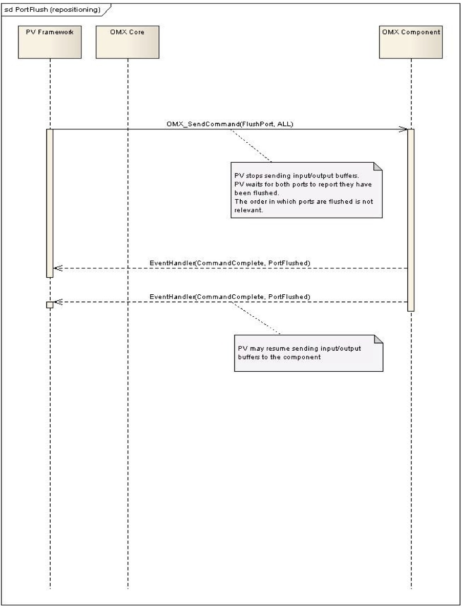

# 1. Introduction

There are several ways to integrate a codec into the PV OpenCore multimedia framework
including as a compressed media I/O component, as a node, and as an OpenMax component
integrated into the OpenMax codecs nodes that are part of the framework. Many codecs,
especially those that include hardware acceleration, implement the OpenMax IL interface making
the OpenMax interface the most straightforward method of integration in those cases.

This document describes the details and sequence diagrams to help integration between the PV
framework and 3rd party OpenMax IL 1.1 compliant components (encoders and decoders). The
sequence diagrams cover the interaction between the PV OpenCore framework and the 3rd party
OMX core as well as the communication between OpenCore and OMX components. This
includes OMX component enumeration, instantiation of an OMX component, setting of various
parameters, input and output port configuration, destruction of the OMX component, etc.
Throughout this document the names PV framework and OpenCore will be used interchangeably.

# 2. General Comment about Call Diagrams

To improve clarity, the call diagrams in this document use simplified naming of calls and do not
provide the full list of OMX call parameters. For full list of OMX call parameters, please refer to
the OpenMax IL 1.1 specification.

# 3. OpenCore and OMX core/component Interaction

The interaction can be divided into several stages described in the following sections. The
sections are ordered to generally follow the sequence of APIs in a typical use-case.

## 3.1. OMX Core initialization

The following steps take place when the OMX core is initialized:

+  `OMX_Init` is called
+  The PV framework enumerates all OMX components by querying their names until OMX
   core returns “`OMX_ErrorNoMore`”. For each OMX component name, PV framework
   queries the OMX component role(s) and builds a registry of available components and
   their roles.
   This interaction is shown in [Figure 1](#f1).

**Figure 1: OMX Core Initialization**

## 3.2. OMX Component instantiation, capabilities and port indices

After the OMX core is initialized, the next step is typically to instantiate a specific component and
enumerate capabilities and port indices. The PV framework will:

+   use the `OMX_GetHandle` call to instantiate the desired OMX component (based on the
    previously acquired component names and roles)
+   use the `OMX_GetParameter` call with a PV proprietary index
    “`PV_OMX_CAPABILITY_TYPE_INDEX`” to obtain the capabilities of the OMX
    component. In case of components that are not fully OpenMax compliant, or in the case
    where the OpenMax spec is ambiguous, the capabilities determine whether the OMX
    component supports “UseBuffer” or “AllocateBuffer” calls on input/output ports or whether
    the OMX component supports partial frames etc.
    NOTE: If OMX component returns “`OMX_ErrorUnsupportedIndex`” for this index (or
    anything other than “`OMX_ErrorNone`”), the PV framework assigns default values
    for component capabilities.
+   use the `OMX_GetParameter` call with “`OMX_IndexVideoInit`” for video components or
    “`OMX_IndexAudioInit`” for audio components, to obtain the number of available ports on
    the OMX component
+   loop over available ports to find the index of the input port (based on the port direction
    supplied by the component)
+   loop over available ports to find the index of the output port (based on the port direction
    supplied by the component).

This interaction (for a video OMX component) is shown in [Figure 2](#f2).

Note:

Index “`PV_OMX_CAPABILITY_TYPE_INDEX`” is defined as:

    #define PV_OMX_COMPONENT_CAPABILITY_TYPE_INDEX 0xFF7A347

The `OMX_GetParameter` call expects the following structure to be filled for this index:

    typedef struct PV_OMXComponentCapabilityFlagsType
    {
            ////////////////// OMX COMPONENT CAPABILITY RELATED MEMBERS
            OMX_BOOL iIsOMXComponentMultiThreaded;
            OMX_BOOL iOMXComponentSupportsExternalOutputBufferAlloc;
            OMX_BOOL iOMXComponentSupportsExternalInputBufferAlloc;
            OMX_BOOL iOMXComponentSupportsMovableInputBuffers;
            OMX_BOOL iOMXComponentSupportsPartialFrames;
            OMX_BOOL iOMXComponentUsesNALStartCode;
            OMX_BOOL iOMXComponentCanHandleIncompleteFrames;
            OMX_BOOL iOMXComponentUsesFullAVCFrames;

    } PV_OMXComponentCapabilityFlagsType;

The capabilities parameters default values are:

**`iIsOMXComponentMultiThreaded`** – the default value is `OMX_TRUE`.
While it is expected that an OMX component would typically run in a separate thread (different
from the thread in which PV framework is running), it is possible that the OMX component is
implemented so that it runs in the same thread as PV framework (e.g., via synchronous calls).

**`iOMXComponentSupportsExternalOutputBufferAlloc`** – the default value is `OMX_TRUE`.
OMX specification mandates that OMX components support externally allocated output buffers
(i.e., `OMX_UseBuffer` call for output buffers). If the component cannot support this, the
component needs to communicate this to the PV framework (by setting this value to
`OMX_FALSE`) so that “`OMX_AllocateBuffer`” call can be used by the PV framework instead.

**`iOMXComponentSupportsExternalInputBufferAlloc`** – the default value is `OMX_TRUE`. OMX
specification mandates that OMX components support externally allocated input buffers (i.e.,
`OMX_UseBuffer` call for input buffers). If the component cannot support this, the component
needs to communicate this to the PV framework (by setting this value to `OMX_FALSE`) so that
“`OMX_AllocateBuffer`” call can be used by the PV framework instead.

**`iOMXComponentSupportsMovableInputBuffers`** – the default value is `OMX_TRUE`.
If OMX buffers are externally allocated, it is possible to decouple the OMX buffer headers
(`OMX_BUFFERHEADERTYPE`) and the actual data buffers (“pBuffer”) to allow for more flexibility
and optimize performance. In other words, to make OMX buffers “movable”, when passing an
input buffer to the OMX component, the “pBuffer” field in the `OMX_BUFFERHEADERTYPE` in a
particular OMX buffer header does not always have to point to the same data buffer. Thus, it is
possible to allocate more actual data buffers to circulate in the framework and to attach them to
the OMX buffer header only when it is necessary to pass them into the OMX component.
If the OMX component requires that an OMX buffer header always points to the exact same data
buffer, then `iOMXComponentSupportsMovableInputBuffers` field needs to be set to `OMX_FALSE`.

**`iOMXComponentSupportsPartialFrames`** – the default value is `OMX_TRUE`.
OMX specification mandates that OMX components support arbitrary data packaging inside
buffers, including the case where a single frame/NAL/decoding unit is split into multiple OMX
buffers. PV framework supplies the “`OMX_BUFFERFLAG_ENDOFFRAME`” markers to facilitate
easy partial frame assembly. However, if OMX component is not capable of
supporting/assembling partial frames, i.e., if OMX component requires PV framework to perform
partial frame assembly and supply the OMX component with a full input frame/NAL, then
`iOMXComponentSupportsPartialFrames` flag needs to be set to `OMX_FALSE`.
NOTE: setting this flag to `OMX_FALSE` may affect performance

**`iOMXComponentUsesNALStartCode`** – the default value is `OMX_FALSE`.
This flag affects H264 decoding. PV framework provides all the information needed to reconstruct
H264 NALs (via the size of all OMX buffers & `OMX_BUFFERFLAG_ENDOFFRAME` flags).
Thus, there is no need for the omx component to parse the bit-stream parsing and the 0x0001
NAL start code to be provided. If the OMX H264 component and the underlying h264 decoder still
rely on bit-stream parsing and require the h264 bit-stream to include the 0x0001 NAL start codes,
then `iOMXComponentUsesNALStartCode` flag needs to be set to `OMX_TRUE`.

**`iOMXComponentCanHandleIncompleteFrames`** – the default value is `OMX_TRUE`.

It is possible that portions of the bit-stream are missing (e.g., due to packet loss).
It is assumed that OMX component and the underlying codec can gracefully handle such cases. If
the OMX component/codec cannot handle incomplete frames, then
“`iOMXComponentCanHandleIncompleteFrames`” flag needs to be set to `OMX_FALSE.` This is
especially important for the case when “`iOMXComponentSupportsPartialFrames`” flag is also set
to `OMX_FALSE`, since this is the case where OMX component itself is not performing partial
frame assembly, i.e., this is the case where PV framework provides assembled frames/NALs to
the OMX component and needs to be informed whether incomplete frames can be safely fed to
the OMX component.

**`iOMXComponentUsesFullAVCFrames`** - the default value is `OMX_FALSE`.
This flag determines whether NAL mode or Frame mode is used in case of AVC.
AVC data can be provided to the OMX component in two different modes depending on the
setting of the capability flag “`iOMXComponentUsesFullAVCFrames`”. The default mode is NAL
mode (when the flag is set to `OMX_FALSE`) and in this mode, the OpenCore framework provides
a single or a partial AVC NAL in an OMX input buffer at a time. In the Frame mode (when the
flag is set to `OMX_TRUE`) – OpenCore framework accumulates AVC NALs and provides the
OMX component with one full AVC frame placed into an OMX input buffer.
NAL boundaries are communicated to the OMX component using `OMX_OTHER_EXTRADATA`
structures. If both `iOMXComponentUsesFullAVCFrames`” and
“`iOMXComponentUsesNALStartCodes`” capability flags are set to `OMX_TRUE` – then NAL
boundaries inside the frame can be inferred by parsing the inserted NAL start codes. In such a
case – `OMX_OTHER_EXTRADATA` structures are not used. The details about the usage of AVC
frame mode and `OMX_OTHER_EXTRADATA` structures are provided in the document “OMX
Core Integration Guide” in section 5.9.

**Figure 2: OMX component instantiation through `OMX_GetHandle`**

## 3.3. OMX component input and output buffer negotiation

Before any data can be exchanged, parameters for the input and output buffers need to be
negotiated. To accomplish this, the PV framework:

+   uses `OMX_GetParameter` call to obtain the input port buffer parameters (minimum/actual
    number of buffers, buffer size etc.)
+   verifies the validity of input buffer parameters (and modifies parameters such as frame
    width/height and possibly the number of buffers)
+   uses `OMX_SetParameter` call to set the input buffer parameters
+   uses `OMX_GetParameter` call to obtain the output port buffer parameters
    (minimum/actual number of buffers, buffer size etc.)
+   verifies the validity of output buffer parameters (and modifies parameters such as frame
    width/height etc., and possibly the number of buffers)
+   uses `OMX_SetParameter` call to set the output buffer parameters

This interaction is shown in [Figure 3](#f3).

Assumptions:

1.  Buffer size assumptions:

    In case of encoder components, final OMX output buffer size that is allocated may be smaller
    than the maximum frame size required by the profile/level/target bitrate etc. due to memory
    consumption considerations. In such a case, OMX encoder components shall be able to divide
    the output bitstream frame/NAL into multiple OMX buffers and mark the final portion of such a
    partial frame/NAL using the “`OMX_BUFFERFLAG_ENDOFFRAME`”.

    In case of decoder components, final OMX input buffer size that is allocated may be smaller than
    the maximum frame size required by the profile/level/target bitrate etc. due to memory
    consumption considerations. PV provides input buffers that are marked by
    “`OMX_BUFFERFLAG_ENDOFFRAME`” when appropriate. If an input buffer contains a full frame
    (NAL unit in case of H264) or multiple full frames, the buffer flag
    “`OMX_BUFFERFLAG_ENDOFFRAME`” will be set for that buffer. In case when a full frame/NAL
    does not fit into one OMX input buffer, the frame/NAL data will be split into multiple OMX buffers.
    The buffers that contain pieces of the frame/NAL, the “`OMX_BUFFERFLAG_ENDOFFRAME`”
    flag bit is set to 0. The buffer carrying the last piece of the partial frame/NAL will have the flag
    “`OMX_BUFFERFLAG_ENDOFFRAME`” bit set to 1. In this way, the component can easily
    reconstruct frames/NALs without having to parse the bitstream data.

    In cases when OMX decoder components are not capable of assembling partial frames/NALs, the
    PV framework will be able to perform the task of assembly. Whether this is possible or not is
    defined by setting OMX component capabilities which was described in the previous section.

2.  Number of input/output buffers:

    The framework may have the desire to allocate more input/output buffers than what the OMX
    component requires in order to provide optimized performance (e.g., in case of the decoder
    output buffers or encoder input buffers – some buffers need to be outstanding to allow extra
    buffering in the framework.) While these buffers are outstanding, they cannot be sent to the OMX
    component.

**Figure 3: OMX component parameter negotiation**

## 3.4. OMX Transition Loaded->Idle State

The buffer allocation is handled as part of the allocation to the Idle state. During this transition,
PV Framework:

+   Issues command to the OMX component to change state from `OMX_StateLoaded` to
    `OMX_StateIdle` via “`OMX_SendCommand`” call
+   Issues a series of either “`OMX_UseBuffer`” calls or “`OMX_AllocateBuffer`” calls to the
    OMX component. The call is used `NumInputBuffer` times for input port, and
    `NumOutputBuffers` for the output port.
+   Waits for the EventHandler callback to arrive from the component which notifies the
    framework that the component state transition is complete (`OMX_EventCmdComplete`).

This interaction is shown in [Figure 4](#f4).

Assumptions and preferences:

According to OMX specification, the compliant OMX component must be able to support both
`OMX_UseBuffer` and `OMX_AllocateBuffer` calls. However, if due to internal component
limitations, this is not possible, the component should be able to communicate its capabilities
(described in the previous section).

It is preferred that INPUT buffers are allocated outside the OMX component so that input data
can be passed into the component without using the unnecessary memory copies (i.e., that the
`OMX_UseBuffer` call is made for input buffers).

**Figure 4: OMX component state transition from `OMX_StateLoaded` to `OMX_StateIdle`**

## 3.5. Transition to “Executing” state and data exchange

The transition to executing starts the active processing of data. In this step, PV Framework:

+   Issues command to the OMX component to change state from `OMX_StateIdle` to
    `OMX_StateExecuting` via “`OMX_SendCommand`” call
+   Waits for the EventHandler callback to arrive from the OMX component which notifies the
    framework that the state transition is complete (`OMX_EventCmdComplete`).
+   Sends input buffers via “`OMX_EmptyThisBuffer`” calls and output buffers via
    “`OMX_FillThisBuffer`” calls to the OMX component. The component returns buffers using
    appropriate callbacks.

This interaction is shown in [Figure 5](#f5).

Notes:

1. If at any time the OMX component has ownership of all the input buffers (i.e., all buffers have
been passed into the component with `EmptyThisBuffer` calls), then no further input buffers can be
sent until the component returns at least one buffer through EmptyBufferDone callback. Similarly,
if the OMX component holds on to all output buffers (`NumOutputBuffers`), the PV framework
cannot continue processing the output until at least one of the OMX output buffers is returned by
the component.

2. The OMX component shall not return the same buffer multiple times in a row without the PV
framework giving the buffer back to the component (i.e., once the component returns a buffer, it
cannot use that same buffer until the PV framework issues `OMX_FillThisBuffer/EmptyThisBuffer`
call for that buffer). This point is a natural consequence of the buffer ownership implied by the
OMX buffer exchange APIs.

**Figure 5: OMX component state transition from `OMX_StateIdle` to `OMX_StateExecuting` and data exchange**

## 3.6. Pausing

A common use-case involves pausing and resuming. In this case, the PV framework:

+   Issues command to the OMX component to change state from `OMX_StateExecuting` to
    `OMX_StatePause` via “`OMX_SendCommand`” call
+   Waits for the EventHandler callback to arrive from the OMX component which notifies the
    framework that the state transition is complete (`OMX_EventCmdComplete`).

After issuing the pause command to the OMX component, the PV framework immediately stops
sending OMX input/output buffers to the component.

In order to resume, the PV framework:

+   Issues command to the OMX component to change state from `OMX_StatePause` to
    `OMX_StateExecuting` via “`OMX_SendCommand`” call
+   Waits for the EventHandler callback to arrive from the OMX component which notifies the
    framework that the state transition is complete (`OMX_EventCmdComplete`).

The PV framework may resume sending OMX input/output buffers to the component (as buffers
become available) after receiving the callback from the component that “Executing” state is
reached.

This interaction is shown in [Figure 6](#f6).

**Figure 6: OMX component state transition from `OMX_StateExecuting` to `OMX_StatePause` and back**

## 3.7. Port flush (if applicable)
The port flush call is typically used with a decoder component during repositioning so that any
queued data is discarded. In this situation, the PV framework:

+   Issues a command to the OMX component to flush ALL (i.e., both) ports via
    “`OMX_SendCommand`” call.
+   Waits for the TWO EventHandler callback to arrive from the OMX component input and
    output ports which notifies the framework that the OMX component has completed
    flushing ports (`OMX_EventCmdComplete`).

The PV framework stops sending OMX input/output buffers to the component immediately after
issuing the flush command. The PV framework may resume sending input/output buffers to the
component after receiving the 2nd callback.

The order in which ports are flushed and reported flushed is irrelevant.

This interaction is shown in [Figure 7](#f7).

Port flush may also be used prior to OMX IL client disabling the OMX component port in case of
dynamic port reconfiguration procedure.

**Figure 7: OMX component port flush procedure**

## 3.8. Stopping/Transition to “Idle” state

In order to stop processing, the PV framework:

+ Issues command to the OMX component to change state from `OMX_StateExecuting` or
     `OMX_StatePause` to `OMX_StateIdle` via “`OMX_SendCommand`” call
+ Waits for the EventHandler callback to arrive from the OMX component which notifies the
     framework that the state transition is complete (`OMX_EventCmdComplete`).

This interaction is shown in [Figure 8](#f8)

Assumption:

When the command complete callback for “Idle” state transition is received, the PV framework
assumes that all OMX input buffers and output buffers have been returned by the OMX
component as mandated by the OMX specification.

**Figure 8: OMX component state transition from `OMX_StateExecuting/Paused` to `OMX_StateIdle`**

## 3.9. OMX Component Transition from Idle->Loaded State and De-initialization

When ending the interaction with an OMX component, the PV framework:

+   Issues command to the OMX component to change state from `OMX_StateIdle` to
    `OMX_StateLoaded` via “`OMX_SendCommand`” call
+   Issues a series of either “`OMX_FreeBuffer`” calls to the component. The call is used
    NumInputBuffer times for input port, and NumOutputBuffers for the output port.
+   Waits for the EventHandler callback to arrive from the OMX component which notifies the
    framework that the state transition is complete (`OMX_EventCmdComplete`).
+   Issues `OMX_FreeHandle` call to OMX core to release the handle of the component.

This interaction is shown in [Figure 9](#f9).

Notes:

Before issuing the command to the component to make the OMX idle->loaded state transition,
the PV framework waits for all the input/output buffers to be returned by the OMX component.
Due to asynchronous processing of callbacks, some EmptyBufferDone/FillBufferDone callbacks
may arrive after the callback that the OMX component transitioned from “executing” to “idle” state.

**Figure 9: OMX component state transition from `OMX_StateIdle` to `OMX_StateLoaded`**

## 3.10. OMX Core De-initialization

PV framework simply calls “`OMX_Deinit()`”.
