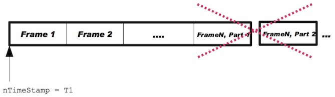

Title: Details on data formats and OMX input buffers

# 5.1. General Notes about Data Formatting

This section provides additional information about the organization of codec data that is provided inside OMX buffers. Generally the [OpenMAX IL spec](https://www.khronos.org/registry/omxil/specs/OpenMAX_IL_1_1_2_Specification.pdf) should provide sufficient details on the data formats, but there are some ambiguities and gaps in the specification that warrant the additional clarification.

## 5.1.1. Frame (or NAL) start codes

The term start codes refers to sequences in the bitstream that mark different boundaries such as frames or NALs in H.264. In general, start codes are NOT provided in most file formats and network protocols, and therefore the PV OpenCORE framework does NOT generally include start codes in the input buffers to OMX component. There are also no headers (e.g., headers that would provide the frame length, etc) artificially inserted into the bitstream within the input buffers.

## 5.1.2. OMX buffer fields

The “`nFilledLen`” OMX buffer field, “`nTimestamp`” OMX buffer field and `OMX_BUFFERFLAG_ENDOFFRAME` OMX buffer flag are used to communicate the size of data provided in the OMX buffer as well as frame (or NAL) boundaries. The OMX components should rely on this information to reconstruct the full frames/NALs if necessary. The `nOffset` is generally set to 0 by the PV OpenCORE IL client, but the OMX component should check the nOffset value in case it is non-zero.

## 5.1.3. Multiple frames in a single OMX input buffer

Exchanging a large number of relatively small buffers may negatively affect performance. Certain codec formats inherently pack data into packets that contain multiple frames (e.g., AMR IETF). In cases where input data frames are relatively small in size (e.g., AMR and most speech formats) – PV framework may pack multiple **FULL** frames into a single OMX input buffer. This is the case for most speech codecs. See sections below for details on which exact formats use packing of multiple frames of data into a single buffer. In such cases, OMX input buffers are still marked with `OMX_BUFFERFLAG_ENDOFFRAME` flag. This is illustrated in [Figure 1](#f1) below.

Note that if packing of multiple frames into one OMX input buffer is used for a particular format – OMX input buffer contains one or more **FULL** frames of data of that format.  The “`nTimestamp`” OMX buffer field refers to the first frame of data in the buffer:

**Figure 1: Packing multiple frames into one OMX buffer**

## 5.1.4. Partial frames/NALs

In case of video formats, the PV OpenCORE framework may place either a full or a partial frame (or NAL) into an OMX input buffer. If a full frame or NAL is placed into the OMX input buffer, then the `OMX_BUFFERFLAG_ENDOFFRAME` flag is applied to that buffer. In case of partial frames/NALs, a frame/NAL may be split into multiple OMX input buffers and sent to the OMX component in pieces. Partial frames generally vary in size. In this case, only the buffer that contains the last piece of the frame/NAL is marked with the `OMX_BUFFERFLAG_ENDOFFRAME` flag. This is illustrated in [Figure 2](#f2) and [Figure 3](#f3) below.

In the case of video formats that allow partial frames, the PV OpenCORE framework **NEVER**
places data that belongs to more than one frame/NAL in the same OMX input buffer which
contains a partial frame/NAL. In streaming cases, it is also possible that data packets contain
multiple **FULL** frames.

In other words, in the case of video formats that allow partial frames, each OMX input buffer can
contain data that belongs to either:

*  multiple **FULL** frames
*  one full frame/NAL
*  portion of a single frame/NAL

`OMX_BUFFERFLAG_ENDOFFRAME` flag (as well as `nTimestamp` field) enable the component
to assemble partial frames.

In the case of formats that allow partial frames – each OMX input buffer that carries the data that belongs to the same frame shall have the same “`nTimestamp`” field. For example, if a frame is split into 3 OMX input buffers, all 3 input buffers will have the same timestamp field – and the last buffer will also have the `OMX_BUFFERFLAG_ENDOFFRAME` flag set.

**NOTE**: If necessary (i.e., if the OMX component is not capable of assembling partial frames), the PV OpenCORE framework can perform the assembly and provide a full frame to the OMX component. In order to enable this feature, it is necessary to use the “capability” flags. In other words, the OMX component must inform the PV OpenCORE framework about its capabilities.  This procedure is described in **Section 3.2.** of the [OpenMAX Call Sequences](http://www.netmite.com/android/mydroid/donut/external/opencore/doc/openmax_call_sequences.pdf) document.

**Figure 2: One full frame stored into one OMX buffer**

**Figure 3: One frame split into N partial frames stored into N OMX buffers**

## 5.1.5. Invalid data packing into OMX buffers

As mentioned above,

1. If PV framework uses packing of multiple frames per one OMX input buffer for a specific codec format, then PV framework will also ensure that only **FULL** frames will appear in such a buffer, and that partial frames **WILL NOT** appear in any OMX buffers for that format. This situation is illustrated in [Figure 4](#f4).

2. If PV framework provides a frame/NAL split into partial frames/NALs for a specific codec format, then PV framework will also ensure that any data that belongs to multiple frames/NALs **WILL NOT** appear in the same OMX buffer. This is illustrated in [Figure 5](#f5).

**Figure 4: Invalid buffer content - If multiple frames are packed into a single OMX buffer, partial frames _WILL NOT_ be stored in that buffer**

**Figure 5: Invalid buffer content - If partial frames are used, data that belongs to more than one frame _WILL NOT_ be stored in the same OMX buffer**

## 5.1.6. Codec configuration data

If applicable, codec configuration data is sent in the first OMX input buffer. Codec configuration data buffer is marked with `OMX_BUFFERFLAG_ENDOFFRAME` and `OMX_BUFFERFLAG_CODECCONFIG` flags.

In case of H264 format, SPS and PPS NAL units are sent in separate OMX input buffers (both buffers are marked using `OMX_BUFFERFLAG_ENDOFFRAME` and `OMX_BUFFERFLAG_CODECCONFIG` flags).

# 5.2. AAC decoder formats

AAC decoder data can be stored in multiple formats. The data in the input OMX buffers is organized as follows:

### 5.2.1. ADIF AAC format

**Codec Configuration Header**: is sent in the first OMX input buffer. The first OMX input buffer contains only the codec configuration data and is marked with `OMX_BUFFERFLAG_ENDOFFRAME` and `OMX_BUFFERFLAG_CODECCONFIG` flag.

**Data**: ADIF AAC format does not provide frame boundaries. The ADIF data is placed into OMX input buffers sequentially and sent to the OMX component. The size of buffers may vary (“`nFilledLen`” buffer field informs the component about the quantity of data in the buffer).

**Note**: As a consequence of the lack of frame boundaries – except for the first OMX buffer (that contains the Codec Configuration Header) that provides the initial timestamp – all other OMX input buffer timestamps are invalid. However, the OMX component is expected to provide valid output buffer timestamps based on the initial input timestamp and the quantity of output PCM data that is produced.

### 5.2.2. ADTS AAC format

**Codec Configuration Header** is sent in the first OMX input buffer. The first OMX input buffer contains only the codec configuration data and is marked with `OMX_BUFFERFLAG_ENDOFFRAME` and `OMX_BUFFERFLAG_CODECCONFIG` flag.

**Data**: Each OMX input buffer contains one (or more than one) full ADTS frames. All OMX input buffers are marked with `OMX_BUFFERFLAG_ENDOFFRAME`. No partial frames are ever placed into OMX input buffer for this format. Since there can be multiple frames in a single OMX input buffer, the OMX component needs to keep consuming the data from the buffer until data is exhausted.

### 5.2.3. LATM AAC format

**Codec Configuration Header** is sent in the first OMX input buffer. The first OMX input buffer contains only the codec configuration data and is marked with `OMX_BUFFERFLAG_ENDOFFRAME` and `OMX_BUFFERFLAG_CODECCONFIG` flag.

**Data**: Each OMX input buffer contains one (or more than one) **FULL** LATM frames. All OMX input
buffers are marked with `OMX_BUFFERFLAG_ENDOFFRAME`. No partial frames are ever placed
into OMX input buffer for this format. Since there can be multiple frames in a single OMX input
buffer, the OMX component needs to keep consuming the data from the buffer until data is
exhausted.

### 5.2.4. MP4 audio AAC format

**Codec Configuration Header** is sent in the first OMX input buffer. The first OMX input buffer contains only the codec configuration data and is marked with `OMX_BUFFERFLAG_ENDOFFRAME` and `OMX_BUFFERFLAG_CODECCONFIG` flag.

**Data**: Each OMX input buffer contains one FULL MP4 Audio frame. All OMX input buffers are marked with `OMX_BUFFERFLAG_ENDOFFRAME`. No partial frames are ever placed into OMX input buffer for this format.

## 5.3. AMR decoder formats

The following applies to both Wide-band and Narrow-band versions of AMR.

**Codec Configuration Header** is **NOT** provided separately for this format. All the necessary
configuration is provided through port parameters (e.g. IF2 vs. IETF)

**Data**: Each OMX input buffer contains one (or more than one) FULL AMR frames. All OMX input buffers are marked with `OMX_BUFFERFLAG_ENDOFFRAME`. No partial frames are ever placed into OMX input buffer for this format. AMR data formatting is based on the RFC 4867 document.

**Note**: In case of RTP, the RTP packet is placed into the OMX input buffer (without the header).  Based on RFC-4867 (RFC-3267), RTP AMR payload data is preceded by the table of contents which lists the frame types and indicates (implicitly) the number of frames present in the buffer.

File storage format and IF2: AMR data for IF2 or File Storage Format contains the frame type field followed by frame data. The frame type field determines the size of the frame that follows.  Since there can be multiple frames in a single OMX input buffer, the OMX component needs to keep consuming the data from the buffer until data is exhausted.

## 5.4. MP3 decoder format

**Codec Configuration Header** is **NOT** provided separately for this format. Each frame of data
carries its own header.

**Data**: Each OMX input buffer contains one (or more than one) FULL MP3 frames. All OMX input buffers are marked with OMX_BUFFERFLAG_ENDOFFRAME. No partial frames are ever placed into OMX input buffer for this format. Since there can be multiple frames in a single OMX input buffer, the OMX component needs to keep consuming the data from the buffer until data is exhausted.

## 5.5. WMA decoder format

**Codec Configuration Header** is sent in the first OMX input buffer. The first OMX input buffer contains only the codec configuration data and is marked with `OMX_BUFFERFLAG_ENDOFFRAME` and `OMX_BUFFERFLAG_CODECCONFIG` flag.

**Data**: Each OMX input buffer contains one (or more than one) FULL WMA frames. All OMX input buffers are marked with `OMX_BUFFERFLAG_ENDOFFRAME`. No partial frames are ever placed into OMX input buffer for this format. Since there can be multiple frames in a single OMX input buffer, the OMX component needs to keep consuming the data from the buffer until data is exhausted.

## 5.6. MPEG4 video decoder format

**Codec Configuration Header** (VOL header) s sent in the first OMX input buffer. The first OMX
input buffer contains only the codec configuration data and is marked with
`OMX_BUFFERFLAG_ENDOFFRAME` and `OMX_BUFFERFLAG_CODECCONFIG` flag.

**Data**: Each OMX input buffer contains either one or more full MPEG4 frames or a portion of a single frame. In case the buffer contains one or more full frames, `OMX_BUFFERFLAG_ENDOFFRAME` flag is applied to the OMX input buffer. In case the buffer contains a partial frame, `OMX_BUFFERFLAG_ENDOFFRAME` flag is applied to the input buffer only if it contains the last piece of that frame. If an OMX buffer contains a partial frame, then data belonging to more than one frame is NEVER placed in the same OMX input buffer .

**Note**: If necessary – i.e. if the OMX component is not capable of assembling partial frames, the PV OpenCORE framework can perform the assembly and provide a full frame to the OMX component. In order to enable this feature, it is necessary to use the “capability” flags. In other words, the OMX component must inform the PV OpenCORE framework about its capabilities.  This procedure is described in **Section 3.2.** of OHA document “[OpenMAX call sequences](http://www.netmite.com/android/mydroid/donut/external/opencore/doc/openmax_call_sequences.pdf)”. Frame assembly in the PV OpenCORE framework may incur a performance penalty.

## 5.7. H263 video decoder format

**Codec Configuration Header** is **NOT** provided separately for this format. Each frame of data
carries its own header.

**Data**: Each OMX input buffer contains either one or more full H263 frames or a portion of a single frame. In case the buffer contains one or more full frames, `OMX_BUFFERFLAG_ENDOFFRAME` flag is applied to the OMX input buffer. In case the buffer contains a partial frame, `OMX_BUFFERFLAG_ENDOFFRAME` flag is applied to the input buffer only if the buffer contains the last piece of that frame. If an OMX buffer contains a partial frame, then data belonging to more than one frame is NEVER placed in the same OMX input buffer.

**Note 1**: H263 is the only format where the very first OMX input buffer might not be marked with `OMX_BUFFERFLAG_ENDOFFRAME`.

Typically, for all other PV supported formats - the first OMX input buffer either contains the codec configuration header or is guaranteed to contain a full frame. In both of these cases – the very first OMX input buffer is always marked with `OMX_BUFFERFLAG_ENDOFFRAME`. This may not be the case for H263 since the first OMX input buffer may contain the first piece of the first h263 frame.

**Note 2**: If necessary – i.e. if the OMX component is not capable of assembling partial frames, the PV OpenCORE framework can perform the assembly and provide a full frame to the OMX component. In order to enable this feature, it is necessary to use the “capability” flags. In other words, the OMX component must inform the PV OpenCORE framework about its capabilities.  This procedure is described in **Section 3.2.** of OHA document “[OpenMAX call sequences](http://www.netmite.com/android/mydroid/donut/external/opencore/doc/openmax_call_sequences.pdf)”. Frame assembly in the PV OpenCORE framework may incur a performance penalty.

## 5.8. WMV decoder format

**Codec Configuration Header** is sent in the first OMX input buffer. The first OMX input buffer contains only the codec configuration data and is marked with `OMX_BUFFERFLAG_ENDOFFRAME` and `OMX_BUFFERFLAG_CODECCONFIG` flag.

**Data**: Each OMX input buffer contains either one or more full WMV frames or a portion of a single frame. In case the buffer contains a full frame, `OMX_BUFFERFLAG_ENDOFFRAME` flag is applied to the OMX input buffer. In case the buffer contains a partial frame, `OMX_BUFFERFLAG_ENDOFFRAME` flag is applied to the input buffer only if it contains the last piece of that frame. If an OMX buffer contains a partial frame, then data belonging to more than one frame is **NEVER** placed in the same OMX input buffer.

**Note**: If necessary – i.e. if the OMX component is not capable of assembling partial frames, the PV OpenCORE framework can perform the assembly and provide a full frame to the OMX component. In order to enable this feature, it is necessary to use the “capability” flags. In other words, the OMX component must inform the PV OpenCORE framework about its capabilities.  This procedure is described in **Section 3.2.** of OHA document “[OpenMAX call sequences](http://www.netmite.com/android/mydroid/donut/external/opencore/doc/openmax_call_sequences.pdf)”. Frame assembly in the PV OpenCORE framework may incur a performance penalty.

## 5.9. H264/AVC decoder format

**Codec Configuration Header**:

SPS and PPS NAL units are sent in the first OMX input buffers (the order in which SPS and PPS
are sent is not guaranteed). SPS and PPS NALs are sent in separate buffers and these input
buffers are marked with `OMX_BUFFERFLAG_ENDOFFRAME` and
`OMX_BUFFERFLAG_CODECCONFIG` flag.

### 5.9.1. AVC NAL Mode vs. AVC Frame mode

AVC data can be provided to the OMX component in two different modes depending on the setting of the capability flag “`iOMXComponentUsesFullAVCFrames`” (described in in **Section 3.2.** of OHA document “[OpenMAX call sequences](http://www.netmite.com/android/mydroid/donut/external/opencore/doc/openmax_call_sequences.pdf)”). The default is NAL mode and in this mode, the OpenCore framework provides a single or a partial AVC NAL in an OMX input buffer at a time. In the Frame mode – OpenCore framework accumulates AVC NALs and provides the OMX component with one full AVC frame placed into an OMX input buffer. NAL boundaries are communicated to the OMX component using `OMX_OTHER_EXTRADATA` structures. If both `iOMXComponentUsesFullAVCFrames`” and “`iOMXComponentUsesNALStartCodes`” capability flags are set to `OMX_TRUE` – then NAL boundaries inside the frame can be inferred by parsing the inserted NAL start codes. In such a case – `OMX_OTHER_EXTRADATA` structures are not
used.

**Data structure – NAL MODE**: Each OMX input buffer contains either one full AVC NAL or a portion of a NAL. In case the buffer contains a full NAL, `OMX_BUFFERFLAG_ENDOFFRAME` flag is applied to the OMX input buffer. In case the buffer contains a partial NAL, `OMX_BUFFERFLAG_ENDOFFRAME` flag is applied to the input buffer only if it contains the last piece of that NAL. Data belonging to more than one NAL is NEVER placed in the same OMX input buffer for this format.

**Data structure – Frame Mode**: Each OMX input buffer contains one full AVC frame. In case where NAL start code insertion is requested by the OMX component, NAL boundaries can be inferred by the OMX component by parsing the OMX input buffer for NAL start codes. In case where NAL start code insertion is NOT requested by the OMX component (default), NAL boundaries (i.e. NAL lengths) are communicated to the OMX component using `OMX_OTHER_EXTRADATA` structure as defined in **section 4.2.33** of the [OpenMax IL spec version 1.1.2.](https://www.khronos.org/registry/omxil/specs/OpenMAX_IL_1_1_2_Specification.pdf)

In Frame Mode, `OMX_BUFFERFLAG_ENDOFFRAME` flag is applied to each and every OMX input buffer. Each buffer in Frame mode **SHALL** have the `OMX_BUFFERFLAG_EXTRADATA` bit set in the nFlags field of the `OMX_BUFFERHEADERTYPE` structure.

At the end of the buffer that contains the AVC frame (i.e. after `nFilledLen+nOffset` bytes counting from the beginning of the buffer)– the following data is appended:

    OMX_OTHER_EXTRADATATYPE extra;
    OMX_OTHER_EXTRADATATYPE terminator;

where:

    extra.eType = OMX_ExtraDataNALSizeArray;
    extra.nSize = 20+4*(number of NALs in the frame); // 20 is the size of OMX_OTHER_EXTRADATATYPE structure + 4 bytes per NAL size
    extra.nDataSize = 4 * (number of NALs in the frame)
    extra.data[4*i] = size of the i-th NAL (data is declared as byte array – so offset is 4*i, since 4 bytes is assigned to signal the size of each NAL unit)

    terminator.eType = OMX_ExtraDataNone;
    terminator.nSize = 20;
    terminator.nDataSize = 0;

Also, “`OMX_ExtraDataNALSizeArray`” is a custom value defined as:

    #define OMX_ExtraDataNALSizeArray 0x7F123321

By reading and interpreting the ``OMX_OTHER_EXTRADATA`` structures – the OMX component can determine the number of NAL units and the size of each NAL unit in the AVC frame – which is sufficient to determine NAL boundaries.

[Figure 6](#f6) shows an example of an OMX buffer in AVC Frame Mode with 2 NALs and with the length values included in the extra data at the end of the buffer. The example is in a similar format to **Figure 4-3** of [1](https://www.khronos.org/registry/omxil/specs/OpenMAX_IL_1_1_2_Specification.pdf). The following is a summary of details for handling the NAL lengths:

1. Each buffer that includes NAL length data SHALL have the `OMX_BUFFERFLAG_EXTRADATA` bit set in the nFlags field of the `OMX_BUFFERHEADERTYPE` structure.
2. The length of each NAL **SHALL** be encoded as a single 4 byte unsigned integer (i.e., the `OMX_U32` type as defined in the OpenMAX specification).
3. The data for the set of all NAL lengths contained in the buffer **SHALL** be encoded as an array of type `OMX_U32` that is located at the end of the buffer.
4. Buffers containing complete frames **SHALL** have the `OMX_BUFFERFLAG_ENDOFFRAME` bit in the nFlags field of the `OMX_BUFFERHEADERTYPE` set.
5. A single buffer **SHALL NOT** contain data from multiple frames.

**Note 1** – Applies to NAL Mode Only: H264/AVC format is NAL based and applies `OMX_BUFFERFLAG_ENDOFFRAME` to mark the NAL (and **NOT** frame) boundaries. It is possible to infer the frame boundary based on the “nTimestamp” buffer fields which contain the same timestamp for all NALs and portions of NALs that belong to the same frame.

**Note 2** – Applies to both NAL and Frame mode: There is no NAL start codes in the bitstream, and by default, NAL start codes are not inserted by the PV OpenCORE framework. If necessary, it is possible for the PV OpenCORE framework to insert NAL start codes at the beginning of each NAL (with a performance penalty). In order to enable this feature, it is necessary to use the “capability” flags. In other words, the OMX component must inform the PV OpenCORE framework about its capabilities. This procedure is described in **Section 3.2.** of OHA document “[ OpenMAX call sequences](http://www.netmite.com/android/mydroid/donut/external/opencore/doc/openmax_call_sequences.pdf)”.

**Note 3** – Applies to both NAL and Frame mode: If necessary – i.e. if the OMX component is not capable of assembling partial NALs, the PV OpenCORE framework can perform the assembly and provide a full NAL to the OMX component. Also – if necessary, the OpenCore framework can perform the collection of NALs into an AVC frame. The two features can be used separately. In order to enable these features, it is necessary to use the “capability” flags. In other words, the OMX component must inform the PV OpenCORE framework about its capabilities. This procedure is described in **Section 3.2.** of OHA document “[OpenMAX call sequences](http://www.netmite.com/android/mydroid/donut/external/opencore/doc/openmax_call_sequences.pdf)”. NAL and frame assembly in the PV OpenCORE framework may incur a performance penalty.

**Figure 6: Example of NAL lengths in the buffer extra data.**

## 5.10. YUV/RGB data format

In case of OMX video encoder components, raw video data is provided in either YUV or RGB format. The PV OpenCORE framework will provide one FULL frame of YUV or RGB data to OMX components.
